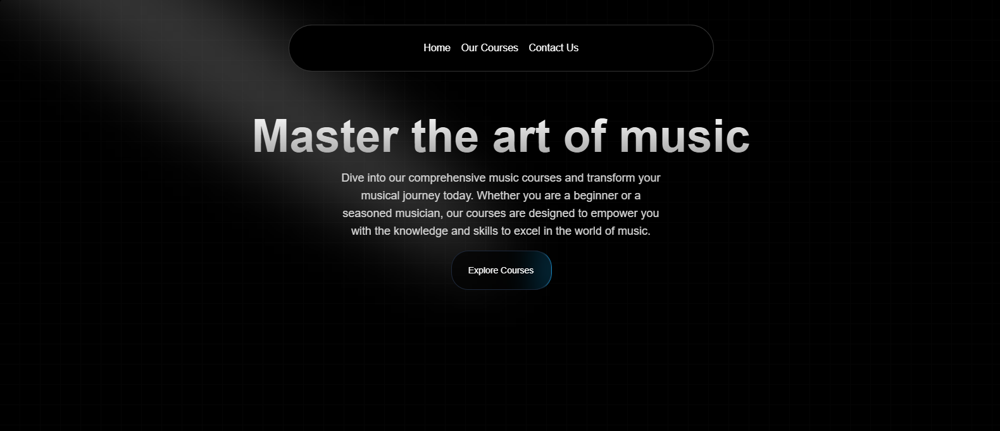

# 🎵 Music Next.js - A Beautiful UI for Music Streaming

## Overview
Music Next.js is a sleek, modern, and responsive music streaming UI built using **Next.js** and **Aceternity UI**. It offers an elegant and interactive experience, focusing on **seamless navigation, dynamic theming, and smooth animations**. This project is designed to provide an immersive **frontend interface** that can be integrated with backend music APIs.

## 🎨 Preview


## 🚀 Features
- 🎧 **Beautiful UI** powered by Aceternity UI
- 🎹 **Course Listings** with detailed descriptions of music programs
- 🎤 **Instructor Profiles** showcasing expertise in various music disciplines
- 🎼 **Smooth Animations** for a dynamic interface
- 🔄 **Responsive Design** for all screen sizes
- 🔍 **Search & Filter** functionality for discovering music easily
- 📜 **Playlists & Albums View** with interactive cards
- ⚡ **Fast Performance** using Next.js SSR & Optimized Components

## 🖥️ Live Demo
Check out the live version of music_nextjs here: [Live Site](https://music-nextjs-mu.vercel.app/)

---

## 🛠️ Installation & Setup
### Prerequisites
Ensure you have the following installed:
- **Node.js** (v16+ recommended)
- **npm** or **yarn**

### Steps to Run Locally
```bash
# Clone the repository
git clone https://github.com/Sankalp20Tiwari/music_nextjs.git

# Navigate to the project folder
cd music_nextjs

# Install dependencies
yarn install  # or npm install

# Run the development server
yarn dev  # or npm run dev
```
The app should now be running at `http://localhost:3000`.


---

## 📂 Project Structure
```
/music_nextjs
├──src/
    ├──app/         # Actual codes
    ├── components  # Reusable UI components
    ├──data/        # Static data
    ├──utils/       # Utilities
├── public          # Static assets (icons, images, etc.)
└── package.json
└── tailwind.config.ts # Config files for tailwind
```

---

## 🛠 Technologies Used
- **Next.js** - Fast & SEO-friendly React framework
- **Aceternity UI** - UI framework for elegant designs and animated components
- **Tailwind CSS** - Utility-first styling
- **Framer Motion** - Smooth animations

---

## 🤝 Contributing
We welcome contributions! To contribute:
1. **Fork** the repository
2. **Create a new branch** (`git checkout -b feature-name`)
3. **Commit your changes** (`git commit -m 'Add feature'`)
4. **Push to your branch** (`git push origin feature-name`)
5. Create a **Pull Request** 🚀

---


